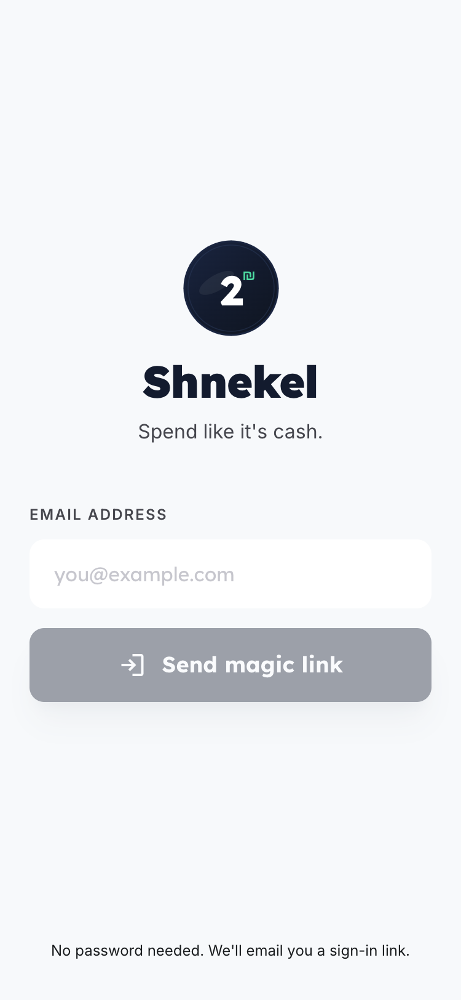
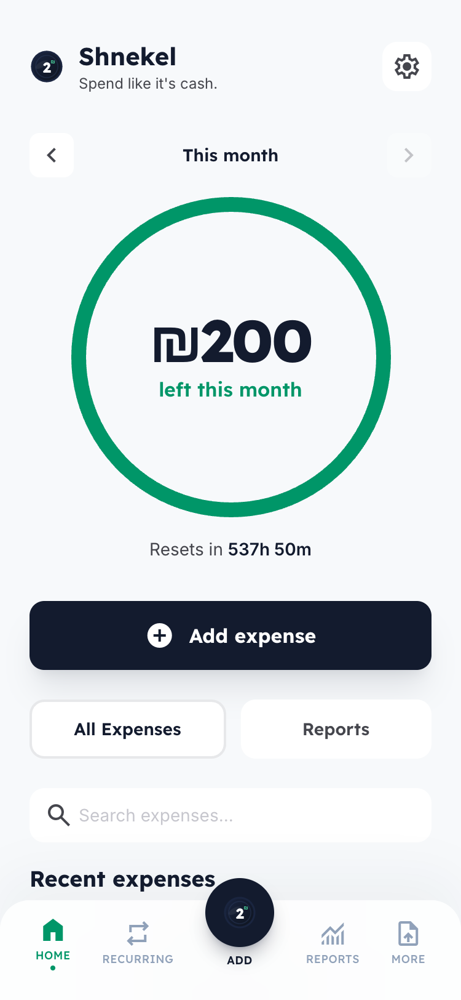
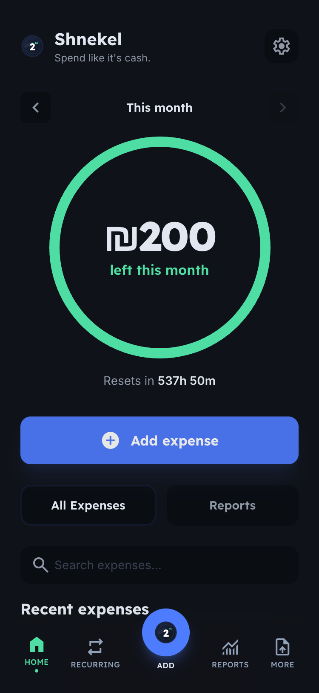
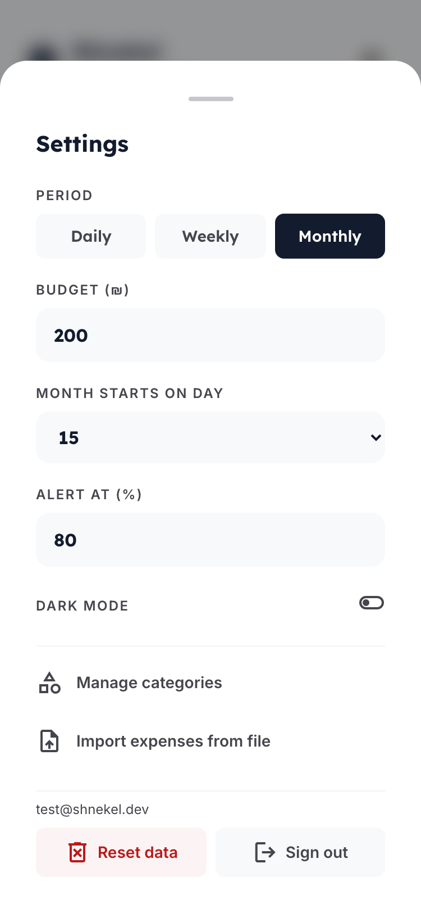
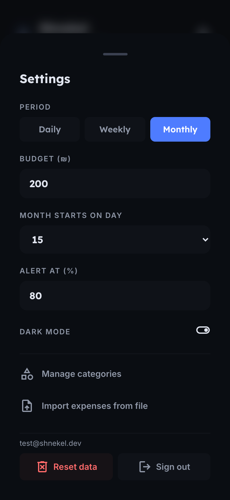
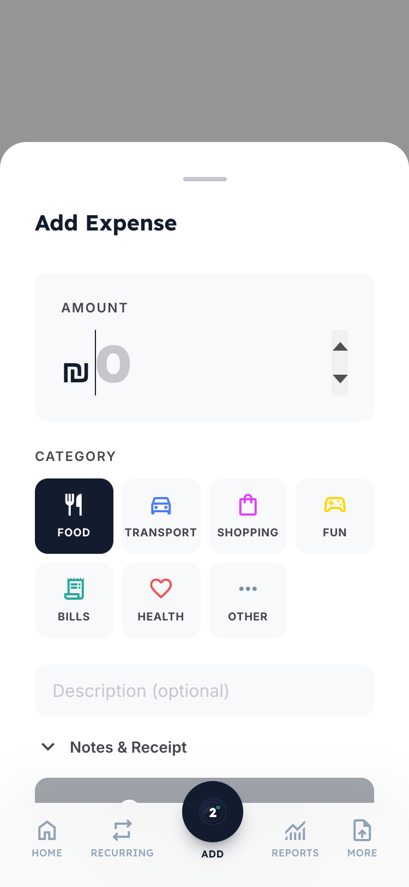
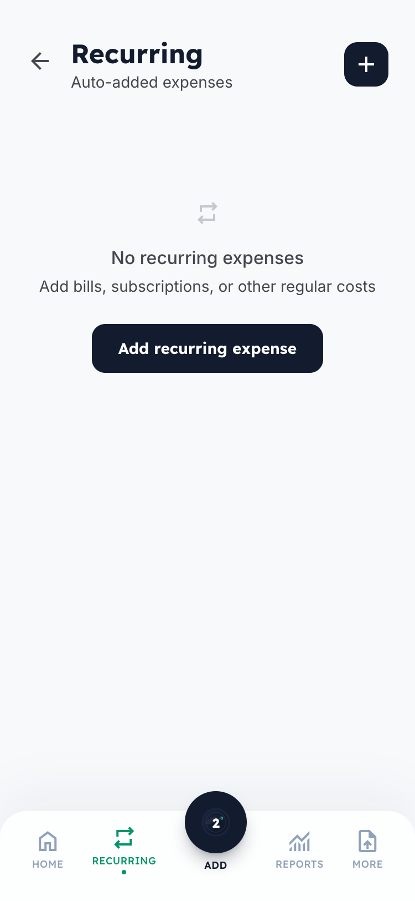
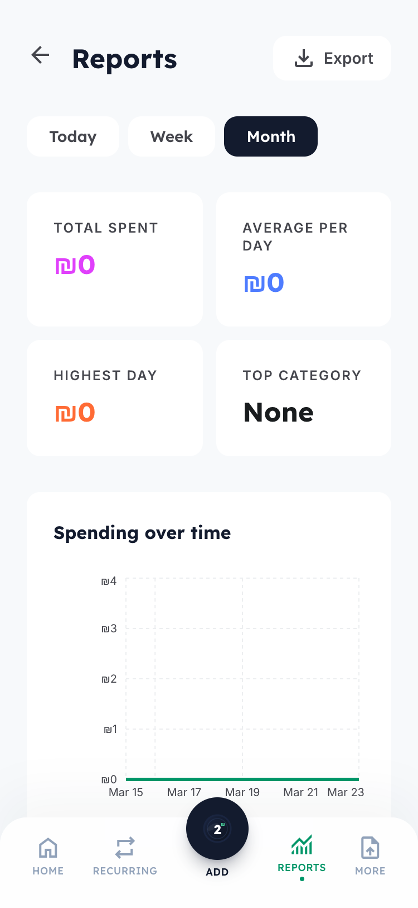
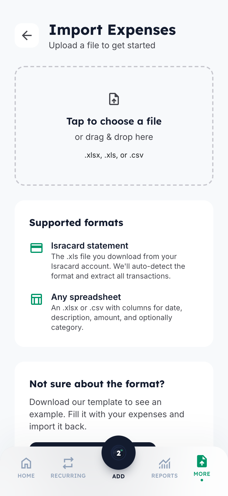
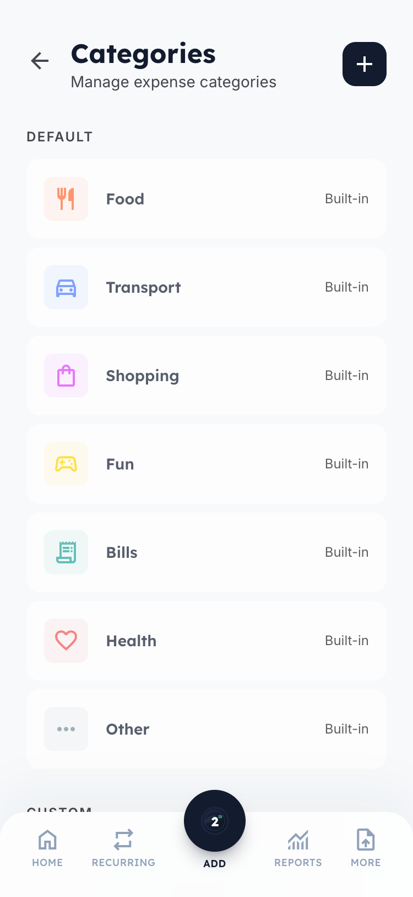

# Shnekel — App Screenshots

All screens captured at 375x812 (iPhone 14 Pro) viewport.

## Screens

### 1. Login

Magic link email authentication. No password needed.

### 2. Dashboard (Light)

Main screen with balance gauge, budget alert, category breakdown, expense list with search.

### 3. Dashboard (Dark)

Same dashboard in dark mode.

### 4. Settings

Bottom sheet overlay with period, budget, month start day, alert threshold, dark mode toggle, category management, import, reset data, and sign out.

### 5. Settings (Dark)

Settings in dark mode.

### 6. Add Expense

Bottom sheet modal with amount input, category picker, description, notes & receipt attachment.

### 7. Recurring Expenses

Manage auto-added expenses — Netflix, Electricity, Bus pass with toggle and delete.

### 8. Reports

Stats cards (total spent, avg/day, highest day, top category) + spending over time chart with period filter.

### 9. Import

File upload for Isracard .xls or generic spreadsheet. Template download available.

### 10. Categories

Default + custom category management with icon and color picker.

---

To regenerate screenshots, run `/qa` in Claude Code which will walk through all screens.
